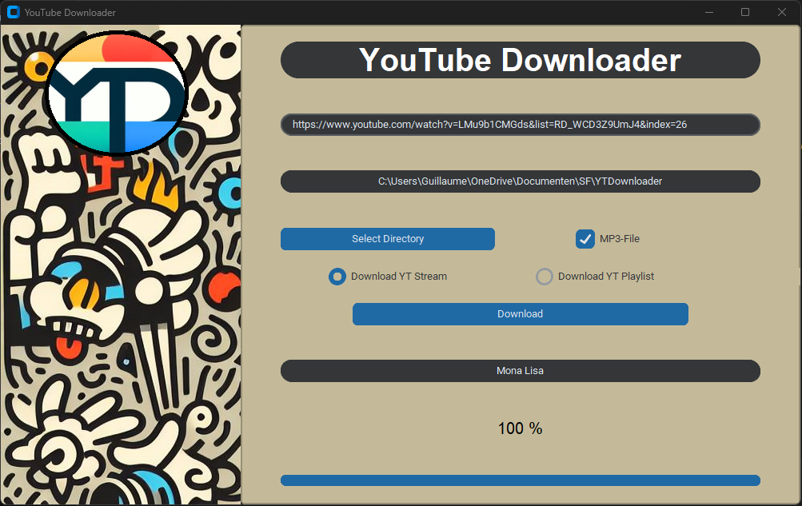

# YouTube Downloader App

This is a simple YouTube downloader application created using Python and the Tkinter library.



## Getting Started

To use the application, follow these steps:

1. Clone the repository:

   ```
   git clone https://github.com/your-username/your-repository.git
   ```

2. Navigate to the project directory:

   ```
   cd your-repository
   ```

3. Install the required dependencies:

   ```
   pip install -r requirements.txt
   ```

4. Run the application:

   ```
   python main.py
   ```

## Features

- Download YouTube videos or playlists.
- Choose the download directory.
- View download progress with a progress bar.

## Requirements

- Python 3.x
- Tkinter
- customtkinter
- pytube
- Pillow

## Usage

1. Launch the application.
2. Enter the video URL or playlist URL in the provided entry field.
3. Choose the download type (individual video or entire playlist) using the radio buttons.
4. Click the "Select Directory" button to choose the download directory.
5. Click the "Download" button to start the download.
6. Monitor the download progress in the progress bar and percentage label.

## Acknowledgments

- [Tkinter](https://docs.python.org/3/library/tkinter.html) - GUI library for Python.
- [pytube](https://github.com/nficano/pytube) - Library for downloading YouTube videos.
- [Pillow](https://python-pillow.org/) - Image processing library.

## License

This project is licensed under the [MIT License](LICENSE).

Replace "your-username" and "your-repository" with your GitHub username and repository name. Additionally, include any screenshots or GIFs of your application in the "Screenshots" section. If you have a license file, make sure to include it and adjust the license section accordingly.